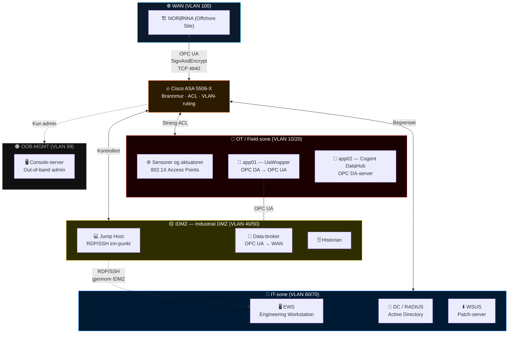
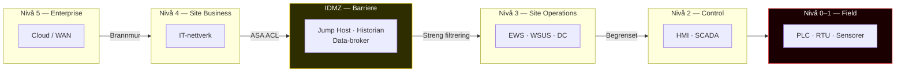

# 🏭 Project AURORA

<div align="center">


**Sikker OT/ICS-nettverksarkitektur for industrielle kontrollsystemer**

*Bacheloroppgave · Elektroingeniør – Cyberfysisk Nettverksteknologi · HVL 2026*

[🌐 Se EXPO-nettsiden](https://jrg1a.github.io/proj-aurora/) · [📊 Arkitekturdiagram](aurora-nettverksarkitektur.html) · [🔄 Dataflytdiagram](dataflow-diagram.html)

</div>

---

## 📖 Om prosjektet

Project AURORA er en bacheloroppgave der vi designer, bygger og tester en komplett OT-nettverksarkitektur fra bunnen av. Prosjektet simulerer et realistisk industriscenario med to geografisk adskilte sites — **AURORA** (onshore) og **NORØNNA** (offshore) — som utveksler prosessdata over **OPC UA (IEC 62541)**.

Prosjektet er utført i samarbeid med **ABB**, som trenger offline-testing av sin UaWrapper-programvare for en CO₂-fangst-kunde. Siden ABB 800xA ikke kan flyttes fysisk, simulerer vi det med OPC Connect Server og Matrikon Explorer i en labmiljø.

### Hovedmål

- Designe en nettverksarkitektur som oppfyller **IEC 62443** (sikkerhetsnivå SL-T 2)
- Implementere **Purdue-modellen** med klare soner og betingede kommunikasjonskanaler
- Konvertere **OPC DA → OPC UA** via UaWrapper med SignAndEncrypt og tag-filtrering
- Dokumentere og teste forsvar mot kjente **MITRE ATT&CK for ICS**-teknikker

---

## 🗺️ Nettverksarkitektur

Arkitekturen er bygget rundt **8 VLANer** fordelt på 5 sikkerhetssoner, separert av en **Cisco ASA 5506-X** brannmur med VLAN-subinterfaces.



---

## 🔒 Sikkerhetssoner (IEC 62443 / Purdue-modellen)



---

## 🛡️ MITRE ATT&CK for ICS — Dekket

| Teknikk | ID | AURORA-tiltak |
|---|---|---|
| Exploitation of Remote Services | T0866 | VLAN-segmentering + ASA ACL |
| Valid Accounts | T0859 | AD/RADIUS + 802.1X |
| Remote Services (lateral movement) | T0886 | Jump Host i IDMZ som eneste inngang |
| Unauthorized Command Message | T0855 | OPC UA SignAndEncrypt + tag-filtrering |
| Manipulation of Control | T0831 | UaWrapper kun lesetilgang |
| Modify Controller Tasking | T0821 | FIELD-sone isolert fra IT/IDMZ |

---

## 🌐 Showcase-nettside

Prosjektet har en fullstendig interaktiv showcase-nettside som dekker:

| Side/seksjon | Beskrivelse |
|---|---|
| 🎯 **Hero** | Animert nettverksvisualisering |
| ⚠️ **Trusselbildet** | 9 virkelige OT-angrep, sektorstatistikk, angrepssimulering |
| 🗺️ **Arkitekturdiagram** | Interaktiv SVG med 3 visningsmoduser |
| 🔐 **MITRE ATT&CK** | ICS kill chain, teknikkkort, tiltakstabell |
| 📊 **Dataflytdiagram** | Sone-til-sone trafikk med protokoller/porter |
| 🔥 **Brannfakler** | Provoserende påstander om OT-sikkerhet (flippkort) |
| 🧠 **Quiz** | 14 tankevkkende spørsmål om OT-sikkerhet |
| 👥 **Team** | Gruppemedlemmer og roller |

---

## 🛠️ Teknologier

<div align="center">


</div>

| Kategori | Teknologi |
|---|---|
| **Protokoll** | OPC UA (IEC 62541), OPC DA (DCOM) |
| **Konvertering** | UaWrapper (ABB), Cogent DataHub |
| **Brannmur** | Cisco ASA 5506-X, VLAN-subinterfaces |
| **Autentisering** | Active Directory, RADIUS, 802.1X |
| **Standard** | IEC 62443, Purdue Model, NIS2 |
| **Nettside** | HTML5, CSS3, Canvas API, SVG |

---

## 📁 Repo-innhold

```
📂 proj-aurora/
├── 📄 index.html                       # Showcase-nettside (GitHub Pages entry point)
├── 📄 aurora-expo.html                 # Showcase-nettside
├── 📄 aurora-nettverksarkitektur.html  # Interaktivt arkitekturdiagram (SVG)
├── 📄 dataflow-diagram.html            # Dataflytdiagram med protokoller/porter
├── 📄 brannfakler.html                 # Provoserende OT-sikkerhetspåstander
├── 📄 quiz.html                        # Interaktiv OT-sikkerhetsquiz (14 spørsmål)
├── 📄 LICENSE                          # MIT-lisens
└── 📄 README.md                        # Denne filen
```

---

## 🚀 Kjør lokalt

Nettsiden er ren HTML/CSS/JS — ingen bygg-steg nødvendig:

```bash
git clone https://github.com/jrg1a/proj-aurora.git
cd proj-aurora

# Åpne direkte i nettleser
open index.html          # macOS
start index.html         # Windows
xdg-open index.html      # Linux
```

> **Merk:** Arkitekturdiagrammet lastes inn via `fetch()` fra `aurora-nettverksarkitektur.html`. For full funksjonalitet, kjør via en lokal webserver:
> ```bash
> python3 -m http.server 8080
> # Åpne http://localhost:8080
> ```

---

## 👥 Team

| Navn | Rolle |
|---|---|
| **Jørgen Austnes** | Elektroingeniør · Cyberfysisk Nettverksteknologi |
| **Axel Sigmar Lien** | Elektroingeniør · Cyberfysisk Nettverksteknologi |
| **Christopher Yarranton Rossebø** | Elektroingeniør · Cyberfysisk Nettverksteknologi |

**Veileder:** Guang Yang (HVL)
**Industripartner:** Erik Serck-Hanssen (ABB)

---

## 📄 Lisens

Dette prosjektet er lisensiert under **MIT-lisensen** — se [LICENSE](LICENSE) for detaljer.

> Bacheloroppgave utført ved Høgskulen på Vestlandet (HVL) i samarbeid med ABB AS, 2026.

---

<div align="center">
  <sub>Project AURORA · HVL / ABB · 2026 · Elektroingeniør – Cyberfysisk Nettverksteknologi</sub>
</div>
